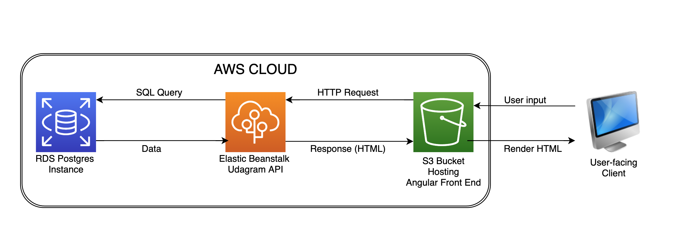

# Overview

- The front-end is hosted in an S3 bucket.
- The API is compressed and deployed on Elastic Beanstalk.
- The Database is a postgres instance of AWS RDS.

## Architecture Diagram

## Live App

The app is available at [http://udagram-api-dev.eba-7hsy6uqr.us-east-1.elasticbeanstalk.com/](http://udagram-api-dev.eba-7hsy6uqr.us-east-1.elasticbeanstalk.com/)
