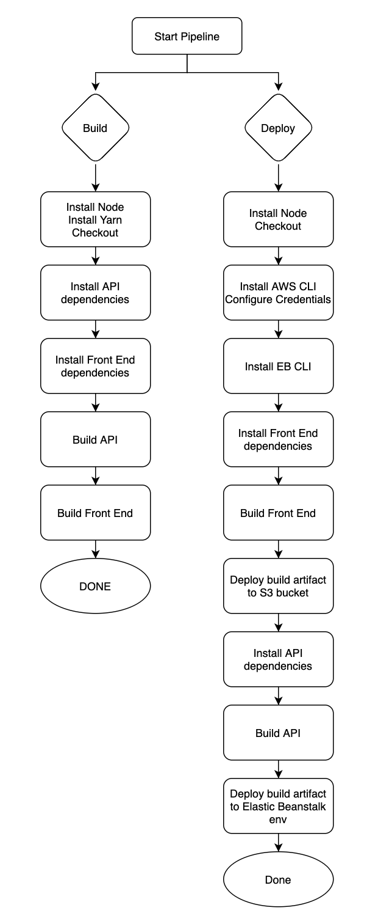

# Introduction

This app relies on CircleCI to automate install, build and deploy processes. The CI/CD pipeline follows the instructions outlined in the `.circleci/config.yml` file.

---

## Orbs

Three orbs are required to run the `udagram` workflow and its two jobs:

- `circleci/node@5.0.0`
- `circleci/aws-cli@2.0.3`
- `circleci/aws-elastics-beanstalk@1.0.0`

---

## Scripts

The pipeline leverages 9 scripts defined in the `package.json` file in the root folder of the project to build, instal and deploy both the API and the Front End:

```json

"scripts": {
    "install:api": "cd udagram-api && npm i",
    "install:frontend": "cd udagram-frontend && npm i",
    "build:api": "cd udagram-api && npm run build",
    "build:frontend": "cd udagram-frontend && npm run build",
    "deploy:api": "cd udagram-api && npm run deploy",
    "frontend:deploy": "cd udagram-frontend && npm run deploy",
    "test:api": "cd udagram-api && npm run test",
    "test:frontend": "cd frontend && npm run test",
    "e2e": "cd frontend && npm run e2e"
}

```

- important note: if the environement bucket is not created , please use this command to create it before running the deploy of backend `eb create -d udagram-api-dev`

---

## Jobs

### Deploy

1. Runs into a docker image
2. Installs node and npm
3. Checkout from GitHub
4. Installs and sets up the AWS CLI
5. Installs and sets up the Elastic Beanstalk CLI
6. Install all the `frontend` dependencies
7. Create a build artifact for the Front End
8. Deploys the build artifact into an AWS S3 bucket
9. Install all the `backend` dependencies
10. Create a build artifact for the API
11. Zips the build artifact and deploys it an Elastic Beanstalk virtual environment

---

## Diagram


{"mode":"full","isActive":false}
